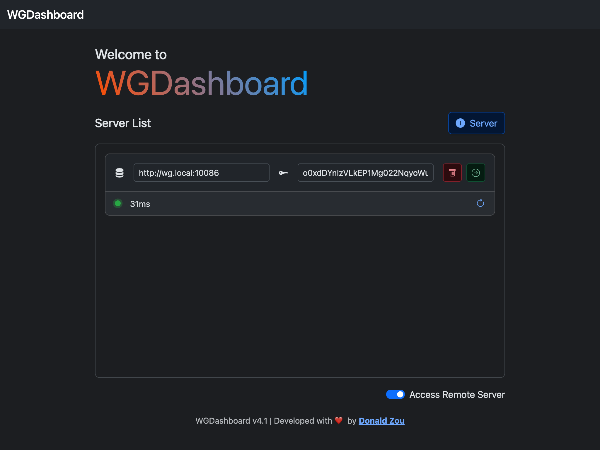

# Access Remote Server

## Enable

To access remote server, simply toggle the **switch** under **Sign In** button in the  page

<video src="../images/user-guides/enable-access-remote-server.mp4" 
preview-src="../images/user-guides/sign-in.png"/>

## Add Remote Server

To add remote see