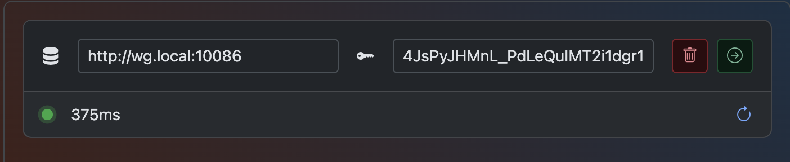
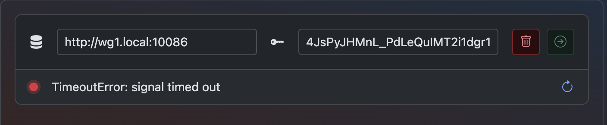

# Access Remote Server

## Enable

To access remote server, simply toggle the **switch** under **Sign In** button in the  page

<video src="https://wgdashboard-resources.tor1.cdn.digitaloceanspaces.com/Documentation%20Images/user-guides/enable-access-remote-server.mp4" 
preview-src="../images/user-guides/sign-in.png"/>

## Add Remote Server

To add remote server, simply toggle the switch, click **+ Server** button, fill in the address and API Key.

<video src="https://wgdashboard-resources.tor1.cdn.digitaloceanspaces.com/Documentation%20Images/user-guides/add-remote-server.mp4" preview-src="../images/user-guides/sign-in.png"/>

### Enter Remote Server

Once you have address and API key filled in, you will see an indicator beneath the inputs telling you if your remote server's status.

#### If success

#### If failed

Usually caused by your address can't be connected, or API Key issue.

