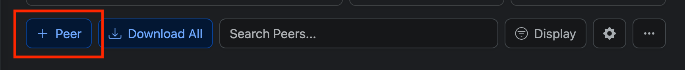

# Add WireGuard Configuration Peers

To add a peer, simply click "+ Peer" button in your configuration

Once you clicked the button, you will see a form similar to adding a configuration, and will need to input the following fields.

- **Name**
  - This is **not a required** field. You can leave it empty to give the peer a name you like.
- **Private Key & Public Key**
  - This is **required** field. Both Private and Public Key will be auto-generated. If you would like to use your own key pair, simply toggle the switch of "Use your own Private and Public Key"
- **Allowed IPs**
  - The IP addresses of this peer. It will be auto-generated with the first available IP Address. You can add more IP Address by clicking "Pick Available IP" button.
  - If you wish to add custom IP Address, you can also type it in the input below.
- **Endpoint Allowed IPs**
  - The IP Address range you want to forward your traffic. For example, if you just want to forward your subnet traffic, you can set it to match configuration's Allowed IPs. 
  - But if you want to forward all traffic through WireGuard, you can set it to `0.0.0.0/0, ::/0`
- **DNS**
  - The DNS servers that this peer will be using.